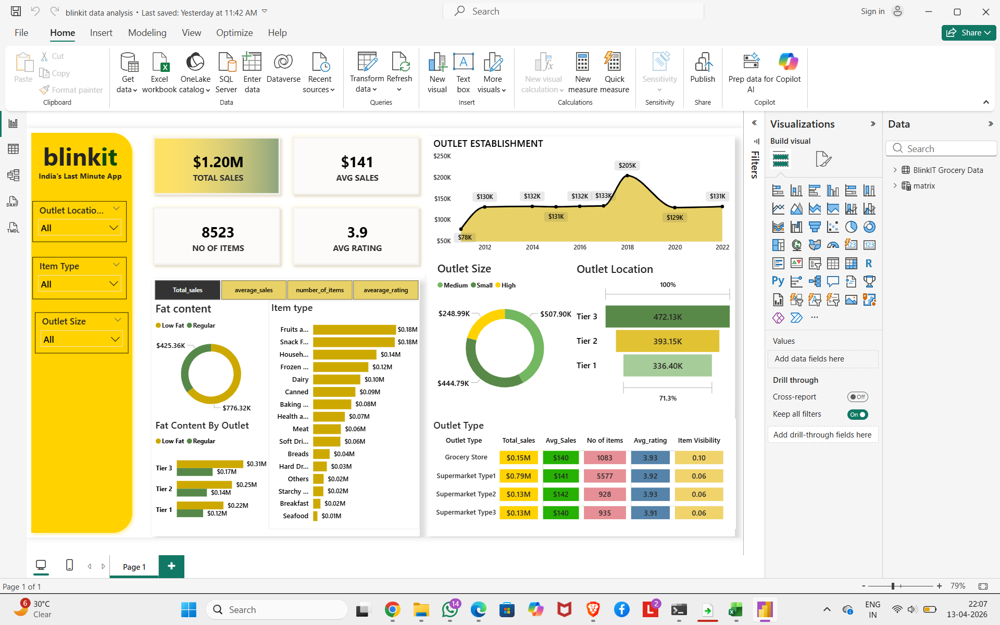

# 📊 Blinkit Data Analysis (Python, SQL, Power BI)

---

## 📌 Overview

This project analyzes Blinkit dataset to generate business insights using Python, SQL, and Power BI dashboards. It helps understand sales trends, customer behavior, and outlet performance.

---

## 📂 Table of Contents

* Overview
* Tools & Technologies
* Project Structure
* Key Performance Indicators (KPIs)
* Detailed Analysis
* Dashboard
* Conclusion

---

## 🛠 Tools & Technologies

* Python (Pandas, NumPy, Matplotlib)
* SQL
* Power BI

---

## 📁 Project Structure

```
Blinkit-Data-Analysis/
│── Dashboard/
│── Images/
│── Notebook/
│── SQL/
```

---

## 📊 Key Performance Indicators (KPIs)

* **Total Sales**: Overall revenue generated from all items sold
* **Average Sales**: Average revenue per sale
* **Number of Items**: Total count of items sold
* **Average Rating**: Average customer rating

---

## 📈 Detailed Analysis

### 1. Total Sales by Fat Content

* Analyzed the impact of fat content on total sales
* Compared all KPIs across fat categories

### 2. Total Sales by Item Type

* Identified top-performing item categories
* Compared KPIs across item types

### 3. Fat Content by Outlet for Total Sales

* Compared sales across outlets based on fat content

### 4. Total Sales by Outlet Establishment

* Evaluated how outlet type/age impacts sales

### 5. Percentage of Sales by Outlet Size

* Analyzed relationship between outlet size and sales

### 6. Sales by Outlet Location

* Studied geographic distribution of sales

### 7. Metrics by Outlet Type

* Compared all KPIs across outlet types

---

## 📷 Dashboard Preview



---

## 📌 Conclusion

This project demonstrates how data analysis and visualization help in making data-driven business decisions.
